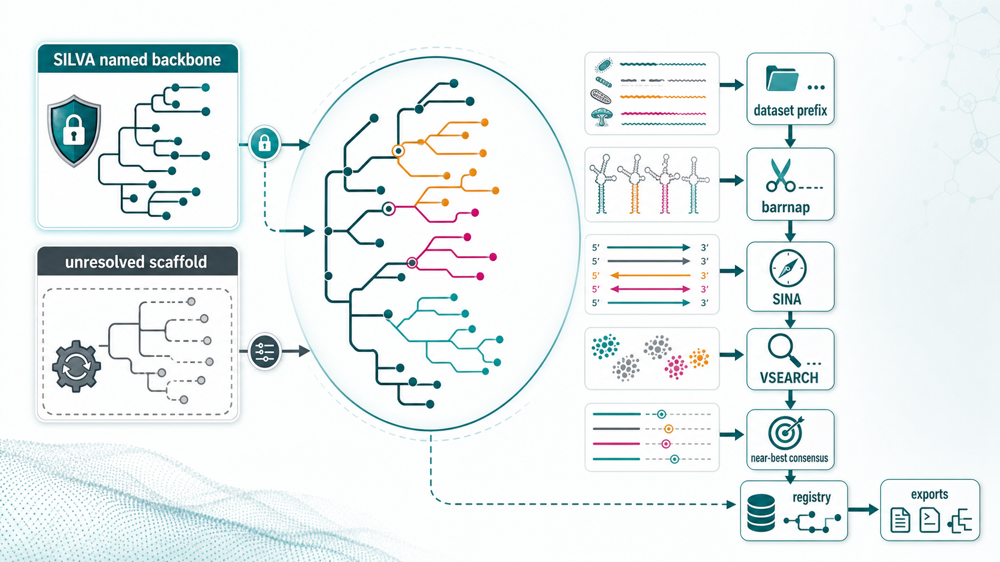

# autotax2

autotax2 is a fixed-backbone, rank-aware, incremental rRNA gene reference
builder.

It builds a classifier-ready rRNA reference from a protected named SILVA
backbone plus user datasets. The central idea is conservative: named SILVA
taxonomy is fixed, unresolved SILVA records become a mutable placeholder
scaffold, and every custom dataset is added with frozen prefixes, internal
sequence IDs, MD5 de-duplication, rRNA recutting, orientation support, VSEARCH
search, near-best hit consensus, and explicit registry validation.

## Overall Algorithm Image



The image above is a visual overview. The authoritative algorithmic contract is
the text below.

## Design Principles

- The SILVA named backbone is immutable: named protected taxa are not renamed,
  reclustered, or replaced.
- SILVA unresolved records may form a mutable placeholder scaffold. These
  placeholders can later be deprecated or superseded, but IDs are never reused.
- Dataset prefixes are supplied during dataset preparation and then frozen.
- Input FASTA IDs are remapped to internal IDs such as `D20_000001`.
- Sequence MD5 is computed from normalized sequence content. Exact duplicate
  sequences are tracked and are not exported repeatedly.
- VSEARCH identity uses fixed `--iddef 2` by default for clustering and search.
- barrnap recutting is mandatory for custom datasets. The expected barrnap
  version is `1.10.5`.
- SINA is used with loose settings for orientation support. SINA failure is not
  fatal by default.
- Placement uses near-best hit consensus, not best-hit-only assignment.
- Exports include SINTAX, QIIME2, DADA2 toGenus, and DADA2 assignSpecies files.

## External Tools

- Python >= 3.10
- barrnap, expected version `1.10.5`
- SINA
- VSEARCH

Normal unit tests do not require barrnap, SINA, VSEARCH, SILVA databases, or
large user datasets. Optional real-tool integration instructions are in
[tests/integration/README.md](tests/integration/README.md).

## Install for Development

```bash
gh repo clone ypchan/autotax2
python -m pip install -e ".[dev]"
python -m pytest
```

## Full Pipeline Quick Start

```bash
autotax2 init \
  --silva-fasta SILVA_138.2_SSURef_NR99_tax_silva.dna.fasta.gz \
  --outdir autotax2_build \
  --domain Archaea

autotax2 resolve-silva \
  --build autotax2_build \
  --threads 48

autotax2 prepare-dataset \
  --build autotax2_build \
  --name digester2020 \
  --prefix D20 \
  --fasta digester2020.intron_free.fa \
  --domain Archaea \
  --threads 48 \
  --strict-tool-version

autotax2 orient-sina \
  --build autotax2_build \
  --dataset digester2020 \
  --threads 48

autotax2 cluster-search \
  --build autotax2_build \
  --dataset digester2020 \
  --threads 48

autotax2 place \
  --build autotax2_build \
  --dataset digester2020

autotax2 export all \
  --build autotax2_build \
  --gzip

autotax2 summarize \
  --build autotax2_build

autotax2 validate \
  --build autotax2_build
```

See [docs/demo_workflow.md](docs/demo_workflow.md) for a compact runnable demo
workflow.

## Data Model

autotax2 uses seven canonical ranks:

```text
domain, phylum, class, order, family, genus, species
```

Taxonomy strings are represented as semicolon-separated seven-rank paths. Export
formatters may add, remove, or rewrite rank prefixes for downstream tools.

Sequence normalization is:

```text
N(seq) = uppercase(remove_whitespace(seq)).replace("U", "T")
sequence_md5 = MD5(N(seq))
```

Internal dataset IDs are assigned in input order:

```text
internal_seq_id = <prefix> + "_" + zero_pad(input_order, 6)
example: D20_000001
```

Placeholder names are rank-aware:

```text
c__SILVAc000001
o__SILVAo000001
f__SILVAf000001
g__SILVAg000001
s__SILVAs000001
g__D20g000001
s__D20s000001
```

The general placeholder formula is:

```text
<rank_prefix>__<source_prefix><rank_letter><6_digit_ordinal>
```

`SILVA` is reserved for unresolved SILVA scaffold placeholders. Custom datasets
must use their frozen dataset prefix.

## Build Directory Layout

```text
autotax2_build/
  registry/
    taxon_nodes.tsv
    sequence_registry.tsv
    dataset_registry.tsv
    name_index.tsv
    cluster_to_taxon.tsv
    placeholder_counters.yaml
    representative_registry.tsv
    representative_history.tsv
  silva/
    silva_named_backbone.fa
    silva_named_backbone.tax.tsv
    silva_unresolved.fa
    silva_unresolved.tsv
    silva_unresolved_taxa.tsv
    silva_unresolved_members.tsv
    silva_unresolved_mapping.tsv
    silva_unresolved.resolved.fa
  datasets/
    01_<dataset>/
      input.normalized.fa
      sequence_id_map.tsv
      unique_sequence_registry.tsv
      sequence_membership.tsv
      barrnap.gff3
      barrnap.extracted.fa
      barrnap.summary.tsv
      prepare_summary.tsv
      sina.oriented.fa
      sina.summary.tsv
      internal_clusters/
      vs_registry.tsv
      vs_registry.filtered.tsv
      assignments.tsv
      created_taxa.tsv
      placement_summary.tsv
  export/
    sintax/
    qiime2/
    dada2/
    export_manifest.tsv
  reports/
    global_summary.tsv
    validation_report.md
```

All project TSVs are tab-delimited with real tab characters and Unix newlines.
FASTA writers wrap sequence lines at 80 characters.

## Command Reference and Algorithm Framework

### `autotax2 --help`

Purpose:
Show the installed CLI, available commands, and option summaries. This command
does not read or write project data.

Input:
No input files are required.

Output:
Rich/Typer help text on standard output.

### `autotax2 init`

Example:

```bash
autotax2 init \
  --silva-fasta SILVA_138.2_SSURef_NR99_tax_silva.dna.fasta.gz \
  --outdir autotax2_build \
  --domain Archaea \
  --type-strain-metadata type_strains.tsv
```

Purpose:
Initialize a build from a SILVA-style FASTA file. This step splits SILVA records
into an immutable named backbone and an unresolved pool that will later become a
mutable scaffold.

Input requirements:

- `--silva-fasta`: plain FASTA or FASTA.gz.
- Header format:

```text
>AB000393.1.1510 Bacteria;Pseudomonadota;Gammaproteobacteria;Enterobacterales;Vibrionaceae;Vibrio;Vibrio halioticoli
```

- The first whitespace-delimited token is the SILVA sequence ID.
- The text after the first whitespace is parsed as taxonomy.
- Up to seven semicolon-separated ranks are read. Fewer than seven ranks are
  padded internally for parsing, but final autotax2 placeholders are not
  allocated during `init`.
- `--domain`, if supplied, must match the taxonomy domain exactly, for example
  `Archaea` or `Bacteria`.
- `--type-strain-metadata`, if supplied, is a TSV with fields:

```text
seq_id, is_type_strain, species_name, strain_id, source, evidence
```

Key parameters:

- `--silva-fasta PATH`: required SILVA FASTA input.
- `--outdir PATH`: required output build directory.
- `--domain TEXT`: optional domain filter.
- `--type-strain-metadata PATH`: optional metadata attached by `seq_id`.

Algorithm framework:

1. Read FASTA records and normalize sequence content.
2. Parse each header into `seq_id` and a seven-rank taxonomy vector:

```text
T = (domain, phylum, class, order, family, genus, species)
```

3. Apply domain filtering if requested:

```text
keep(record) = taxonomy.domain == requested_domain
```

4. Detect unresolved ranks using case-insensitive tokens such as
   `unidentified`, `unclassified`, `uncultured`, `unknown`, `environmental`,
   `metagenome`, `sample`, `clone`, `bacterium`, `archaeon`, and `organism`.
5. Treat species strings like `Methanobacterium sp.` as unresolved at species
   rank only; the genus can remain reliable.
6. Compute:

```text
lowest_reliable_rank = rank immediately above the first unresolved rank
unresolved_ranks = all ranks from the first unresolved rank to species
is_unresolved = len(unresolved_ranks) > 0
```

7. Write fully named records to the protected named backbone.
8. Write unresolved records to the unresolved SILVA pool.
9. Create protected taxon nodes for named SILVA ranks only.
10. Attach optional type-strain metadata to `sequence_registry.tsv`.

Main outputs:

- `silva/silva_named_backbone.fa`: named SILVA sequences.
- `silva/silva_named_backbone.tax.tsv`: fields:

```text
seq_id, taxonomy_7rank, domain, phylum, class, order, family, genus, species
```

- `silva/silva_unresolved.fa`: unresolved SILVA sequences.
- `silva/silva_unresolved.tsv`: fields:

```text
seq_id, original_taxonomy, domain, phylum, class, order, family, genus,
species, lowest_reliable_rank, unresolved_ranks, unresolved_reason
```

- `registry/taxon_nodes.tsv`: protected named SILVA taxon nodes.
- `registry/sequence_registry.tsv`: SILVA sequence metadata, MD5, original
  taxonomy, named/unresolved flags, and optional type-strain metadata.
- `registry/dataset_registry.tsv`: initial SILVA source row.
- `registry/name_index.tsv`: taxon name lookup.
- `logs/init.log`: counts and input summary.

### `autotax2 resolve-silva`

Example:

```bash
autotax2 resolve-silva \
  --build autotax2_build \
  --threads 8 \
  --iddef 2
```

Purpose:
Convert unresolved SILVA records into an active mutable scaffold of SILVA
placeholder taxa while leaving the named SILVA backbone unchanged.

Input requirements:

- A build previously initialized by `autotax2 init`.
- `silva/silva_unresolved.fa`
- `silva/silva_unresolved.tsv`
- Current registry files under `registry/`.
- VSEARCH is used when available. In tests or mocked runs, pre-existing `.uc`
  files can be used.

Key parameters:

- `--build PATH`: required build directory.
- `--threads INT`: VSEARCH threads, default `4`.
- `--species-id FLOAT`: species-level cluster threshold, default `0.987`.
- `--genus-id FLOAT`: genus-level cluster threshold, default `0.945`.
- `--family-id FLOAT`: reserved threshold, default `0.865`.
- `--order-id FLOAT`: reserved threshold, default `0.820`.
- `--class-id FLOAT`: reserved threshold, default `0.785`.
- `--floor-id FLOAT`: reserved floor, default `0.750`.
- `--vsearch-bin TEXT`: VSEARCH executable, default `vsearch`.
- `--iddef INT`: VSEARCH identity definition, default `2`.
- `--dry-run`: write proposals without registry mutation.

Algorithm framework:

1. Load unresolved SILVA records and unresolved-rank classification.
2. Cluster unresolved sequences at genus threshold:

```text
vsearch --cluster_fast silva_unresolved.fa --id 0.945 --iddef 2
```

3. Cluster unresolved sequences at species threshold:

```text
vsearch --cluster_fast silva_unresolved.fa --id 0.987 --iddef 2
```

4. Parse `.uc` cluster assignments. A centroid record `S` starts a cluster; a
   hit record `H` joins a member to a centroid.
5. For each unresolved record, preserve all reliable named ranks from the
   original taxonomy.
6. For ranks marked unresolved, allocate or reuse SILVA placeholders by
   `cluster_key`.
7. Placeholder reuse rule:

```text
if active cluster_key exists:
    reuse its active taxon
else:
    allocate the next never-used placeholder ID
```

8. Deprecated and superseded placeholder names are treated as burned IDs and
   are never reused.
9. If records in the same unresolved cluster come from different original SILVA
   parent paths, do not fail. Record warning:

```text
mixed_silva_parent_unresolved_cluster
```

10. Write resolved seven-rank taxonomy for each unresolved SILVA sequence.

Main outputs:

- `silva/silva_unresolved_clusters/genus_0.945.uc`
- `silva/silva_unresolved_clusters/species_0.987.uc`
- `silva/silva_unresolved_taxa.tsv`: fields:

```text
taxon_id, rank, name, parent_taxon_id, source, source_prefix, cluster_key,
status, representative_seq_id, member_count, warning
```

- `silva/silva_unresolved_members.tsv`: fields:

```text
seq_id, original_taxonomy, resolved_taxonomy, lowest_reliable_rank,
unresolved_ranks, genus_placeholder, species_placeholder, cluster_key_genus,
cluster_key_species, warning
```

- `silva/silva_unresolved_mapping.tsv`: fields:

```text
seq_id, original_silva_taxonomy, resolved_autotax2_taxonomy, source,
source_prefix, placeholder_taxa, warnings
```

- `silva/silva_unresolved.resolved.fa`: unresolved SILVA sequences with resolved
  autotax2 taxonomy in headers.
- Registry updates:

```text
registry/taxon_nodes.tsv
registry/name_index.tsv
registry/cluster_to_taxon.tsv
registry/placeholder_counters.tsv
```

Dry-run outputs use `.dry_run.tsv` suffixes and do not update registry counters.

### `autotax2 prepare-dataset`

Example:

```bash
autotax2 prepare-dataset \
  --build autotax2_build \
  --name digester2020 \
  --prefix D20 \
  --fasta digester2020.intron_free.fa \
  --domain Archaea \
  --threads 8 \
  --strict-tool-version
```

Purpose:
Prepare a custom intron-free dataset for registry search and placement. The
step freezes the dataset prefix, assigns internal IDs, records MD5 duplicates,
and uses barrnap to recut rRNA gene boundaries.

Input requirements:

- `--build`: initialized and, usually, SILVA-resolved build directory.
- `--fasta`: plain FASTA or FASTA.gz containing intron-free input sequences.
- FASTA headers may repeat; internal IDs remain unique.
- Sequence normalization uses uppercase, `U -> T`, whitespace removal.
- By default, normalized sequences containing symbols outside `A/T/G/C` are
  rejected.
- `--domain` must be `Archaea` or `Bacteria`.
- barrnap must be available unless tests provide a mocked `barrnap.gff3`.

Key parameters:

- `--name TEXT`: dataset name, for example `digester2020`.
- `--prefix TEXT`: frozen prefix, for example `D20`.
- `--threads INT`: barrnap threads, default `4`.
- `--barrnap-bin TEXT`: barrnap executable, default `barrnap`.
- `--barrnap-kingdom TEXT`: optional override. Default mapping:

```text
Archaea -> arc
Bacteria -> bac
```

- `--strict-tool-version`: fail unless barrnap `1.10.5` is detected.
- `--multi-rrna-policy`: one of `longest`, `best`, `all`, `fail`; default
  `longest`.
- `--min-rrna-len-archaea INT`: default `900`.
- `--min-rrna-len-bacteria INT`: default `1200`.
- `--flank INT`: extra bases around barrnap hit, default `0`.
- `--allow-partial`: reserved for partial feature policy.
- `--reject-non-atgc/--no-reject-non-atgc`: default reject non-ATGC.

Algorithm framework:

1. Validate dataset name and prefix.
2. Check prefix freezing rules:

```text
same dataset + different prefix -> fail
same prefix + different dataset -> fail
prefix SILVA for custom data -> invalid
```

3. Compute input file MD5 and assign dataset add order. First custom dataset is
   written under `datasets/01_<name>/`.
4. Read input FASTA, normalize sequences, and assign IDs:

```text
D20_000001, D20_000002, ...
```

5. Compute sequence MD5 from normalized full input sequence:

```text
md5_i = MD5(N(seq_i))
```

6. Build local unique-sequence and membership tables. A duplicate has the same
   `sequence_md5` as an earlier accepted record but keeps its own internal ID.
7. Write `input.normalized.fa` using internal IDs.
8. Run barrnap:

```text
barrnap --kingdom arc --threads N input.normalized.fa > barrnap.gff3
```

9. Parse GFF3 records with fields:

```text
seqid, source, type, start, end, score, strand, phase, attributes
```

10. Keep flexible SSU/16S/rRNA features, including labels such as `16S_rRNA`,
    `SSU_rRNA`, `16S ribosomal RNA`, and `small subunit ribosomal RNA`.
11. For each sequence, select hits:

```text
longest: choose max(end - start + 1)
best: choose max(score), fallback to longest
all: emit every rRNA hit with _rrna1, _rrna2 suffixes
fail: reject if more than one rRNA hit exists
```

12. Recut interval using 1-based inclusive GFF3 coordinates:

```text
cut_start = max(1, start - flank)
cut_end   = min(sequence_length, end + flank)
slice     = sequence[cut_start - 1 : cut_end]
```

13. If `strand == "-"`, reverse-complement the extracted sequence.
14. Apply domain-specific length filter:

```text
Archaea: extracted_length >= 900 by default
Bacteria: extracted_length >= 1200 by default
```

Main outputs:

- `datasets/NN_<name>/input.normalized.fa`: accepted normalized full sequences.
- `sequence_id_map.tsv`: fields:

```text
internal_seq_id, original_seq_id, original_header, dataset, prefix,
input_order, sequence_md5, input_length, normalized_length, rejected,
reject_reason
```

- `unique_sequence_registry.tsv`: fields:

```text
unique_seq_id, sequence_md5, representative_internal_seq_id, sequence,
length, first_seen_dataset
```

- `sequence_membership.tsv`: fields:

```text
internal_seq_id, original_seq_id, dataset, prefix, sequence_md5,
unique_seq_id, is_duplicate_sequence
```

- `barrnap.gff3`: raw barrnap feature output.
- `barrnap.log`: barrnap stderr or mock note.
- `barrnap.extracted.fa`: recut rRNA sequences.
- `barrnap.summary.tsv`: fields:

```text
internal_seq_id, extracted_seq_id, original_seq_id, dataset, domain,
input_length, hit_count, selected_hit_index, barrnap_type, barrnap_start,
barrnap_end, barrnap_strand, barrnap_score, extracted_start, extracted_end,
extracted_length, reverse_complemented, status, warning
```

- `prepare_summary.tsv`: fields:

```text
dataset, prefix, input_sequences, normalized_sequences, rejected_non_atgc,
duplicate_md5_sequences, barrnap_extracted, no_barrnap_hit,
multiple_rrna_hits, rejected_short_rrna, final_prepared_sequences
```

- `tool_versions.tsv`: barrnap version/status/command.
- `registry/dataset_registry.tsv`: frozen dataset registration.

### `autotax2 orient-sina`

Example:

```bash
autotax2 orient-sina \
  --build autotax2_build \
  --dataset digester2020 \
  --threads 8
```

Purpose:
Use SINA with loose settings to support orientation correction. This step keeps
internal sequence IDs stable. SINA failures are non-fatal by default.

Input requirements:

- Prepared dataset directory.
- `datasets/NN_<dataset>/barrnap.extracted.fa`
- Optional SINA reference/PTDB path.

Key parameters:

- `--threads INT`: SINA threads, default `4`.
- `--sina-bin TEXT`: SINA executable, default `sina`.
- `--reference PATH`: optional reference passed as `--ptdb`.
- `--strict-tool-version`: fail if SINA version cannot be detected.
- `--allow-sina-failure/--no-allow-sina-failure`: default allow failure.
- `--fallback-copy-original/--no-fallback-copy-original`: default copy original
  records if SINA fails or omits an ID.
- `--min-sina-identity FLOAT`: reserved loose confidence threshold.
- `--min-sina-score FLOAT`: reserved loose confidence threshold.

Algorithm framework:

1. Read `barrnap.extracted.fa`.
2. Build a loose command:

```text
sina -i barrnap.extracted.fa -o sina.oriented.fa --threads N
```

3. If `--reference` is supplied, append:

```text
--ptdb <reference>
```

4. Run `sina --version` and record the detected value if parseable.
5. If SINA fails and failure is allowed with fallback enabled, copy all input
   records to `sina.oriented.fa` and mark them uncertain.
6. If SINA succeeds, read output FASTA and compare each output record to input:

```text
output == input             -> strand plus, confidence high
output == reverse_complement(input) -> strand minus, confidence high
otherwise                   -> oriented_modified, confidence low
missing output              -> fallback original if enabled
```

7. Preserve input sequence IDs exactly.

Main outputs:

- `sina.oriented.fa`: oriented or fallback sequences.
- `sina.summary.tsv`: fields:

```text
internal_seq_id, dataset, input_length, output_length, sina_status, strand,
orientation_confidence, sequence_changed, fallback_used, warning
```

- `sina.log`: SINA stderr or failure text.
- `tool_versions.tsv`: SINA version/status/command row.

Status values:

```text
oriented
oriented_modified
orientation_uncertain
sina_missing_output
sina_failed_fallback_original
failed
```

### `autotax2 cluster-search`

Example:

```bash
autotax2 cluster-search \
  --build autotax2_build \
  --dataset digester2020 \
  --threads 16 \
  --iddef 2 \
  --strand plus
```

Purpose:
Cluster oriented dataset sequences at rank-aware thresholds and search species
centroids against the current registry representatives. This step keeps multiple
passing hits for later near-best consensus.

Input requirements:

- `datasets/NN_<dataset>/sina.oriented.fa`
- Current registry files.
- Existing or buildable `registry/current_representatives.fa`.
- VSEARCH executable unless tests provide mocked output files.

Key parameters:

- `--threads INT`: VSEARCH threads, default `4`.
- `--vsearch-bin TEXT`: VSEARCH executable, default `vsearch`.
- `--strict-tool-version`: fail if VSEARCH version cannot be parsed.
- `--iddef INT`: identity definition, default `2`.
- `--species-id FLOAT`: default `0.987`.
- `--genus-id FLOAT`: default `0.945`.
- `--family-id FLOAT`: default `0.865`.
- `--order-id FLOAT`: default `0.820`.
- `--class-id FLOAT`: default `0.785`.
- `--floor-id FLOAT`: registry search identity floor, default `0.750`.
- `--min-query-cov FLOAT`: default `0.80`.
- `--min-target-cov FLOAT`: default `0.0`.
- `--maxaccepts INT`: default `50`.
- `--maxrejects INT`: default `256`.
- `--near-best-delta FLOAT`: recorded for placement, default `0.005`.
- `--strand plus|both`: default `plus`.

Algorithm framework:

1. Check VSEARCH version and record it.
2. Independently cluster `sina.oriented.fa` at each rank threshold:

```text
vsearch --cluster_fast sina.oriented.fa \
  --id threshold \
  --iddef 2 \
  --centroids <rank>_<threshold>.centroids.fa \
  --uc <rank>_<threshold>.uc \
  --threads N
```

3. Current thresholds:

```text
species 0.987
genus   0.945
family  0.865
order   0.820
class   0.785
```

4. Parse `.uc` records:

```text
S = centroid/seed record
H = hit/member record
cluster_id = UC cluster number
centroid_id = seed label
member_id = query label
identity_to_centroid = percent identity for H, 100 for S
```

5. Build registry representatives if missing, using active SILVA named,
   resolved SILVA unresolved, and earlier custom dataset records.
6. Search species centroids against current registry representatives:

```text
vsearch --usearch_global species_0.987.centroids.fa \
  --db registry/current_representatives.fa \
  --id 0.750 \
  --iddef 2 \
  --maxaccepts 50 \
  --maxrejects 256 \
  --strand plus \
  --userout vs_registry.raw.tsv \
  --userfields query+target+id+alnlen+qlo+qhi+tlo+thi+ql+tl+bits
```

7. Compute coverage:

```text
query_coverage  = alnlen / query_length
target_coverage = alnlen / target_length
```

8. Filter hits:

```text
identity >= floor_id
query_coverage >= min_query_cov
target_coverage >= min_target_cov
```

9. Preserve all passing hits. Do not collapse to the best hit.

Main outputs:

- `internal_clusters/species_0.987.uc`
- `internal_clusters/species_0.987.centroids.fa`
- `internal_clusters/species_0.987.members.tsv`
- Equivalent genus/family/order/class `.uc`, `.centroids.fa`, `.members.tsv`
  files.
- Cluster member TSV fields:

```text
cluster_id, centroid_id, member_id, identity_to_centroid, record_type,
rank_threshold
```

- `vs_registry.tsv`: raw parsed registry hits.
- `vs_registry.filtered.tsv`: passing registry hits.
- Registry hit fields:

```text
query, target, identity, alnlen, qlo, qhi, tlo, thi, ql, tl, bits,
query_coverage, target_coverage
```

- `cluster_search_summary.tsv`: fields:

```text
dataset, prefix, input_sequences, species_centroids, genus_centroids,
family_centroids, order_centroids, class_centroids, registry_representatives,
registry_hits_raw, registry_hits_filtered, iddef, min_query_cov,
min_target_cov, near_best_delta, vsearch_version
```

- `tool_versions.tsv`: VSEARCH version/status/command row.

### `autotax2 place`

Example:

```bash
autotax2 place \
  --build autotax2_build \
  --dataset digester2020 \
  --near-best-delta 0.005 \
  --rank-consensus 0.80
```

Purpose:
Place dataset representative sequences into the current rank-aware taxonomy
registry by combining identity thresholds with near-best hit consensus.

Input requirements:

- `vs_registry.filtered.tsv`
- `internal_clusters/species_0.987.uc`
- `sequence_membership.tsv`
- `sequence_id_map.tsv`
- Registry files:

```text
taxon_nodes.tsv
sequence_registry.tsv
representative_registry.tsv
name_index.tsv
placeholder_counters.yaml
cluster_to_taxon.tsv
dataset_registry.tsv
```

Key parameters:

- `--near-best-delta FLOAT`: default `0.005`.
- `--rank-consensus FLOAT`: default `0.80`.
- `--species-id FLOAT`: known-like boundary, default `0.987`.
- `--genus-id FLOAT`: new-species boundary, default `0.945`.
- `--family-id FLOAT`: new-genus boundary, default `0.865`.
- `--order-id FLOAT`: new-family boundary, default `0.820`.
- `--class-id FLOAT`: new-order boundary, default `0.785`.
- `--floor-id FLOAT`: minimum placement identity, default `0.750`.
- `--dry-run`: write proposed outputs without registry mutation.
- `--allow-ambiguous/--no-allow-ambiguous`: default allow ambiguous rows.

Algorithm framework:

1. Load dataset prefix from `dataset_registry.tsv`.
2. Load taxon tree, representatives, sequence membership, and filtered hits.
3. Detect duplicate MD5 sequences already present in the registry. Duplicates
   receive final status `duplicate` and do not create new taxa.
4. For each query representative, compute:

```text
best_identity(q) = max(identity(q, target))
```

5. Retain near-best hits:

```text
H_nb(q) = {h | identity(h) >= best_identity(q) - near_best_delta}
```

6. For each rank `r`, compute consensus:

```text
fraction_r(t) = count(h in H_nb with taxon_r(h) == t) / len(H_nb)
consensus_r = argmax_t fraction_r(t)
stable_r = fraction_r(consensus_r) >= rank_consensus
```

7. The lowest stable rank is the lowest rank, from species upward to domain,
   where `stable_r` is true.
8. Convert best identity to initial status:

```text
x >= species_id -> known_like
x >= genus_id   -> new_species
x >= family_id  -> new_genus
x >= order_id   -> new_family
x >= class_id   -> new_order
x >= floor_id   -> new_class
else            -> unplaced
```

9. Combine identity status with consensus. Examples:

```text
known_like + stable species -> assign existing species
known_like + unstable species + stable genus -> create new species
new_species + stable genus -> create species under that genus
new_species + unstable genus + stable family -> create genus + species
new_genus + stable family -> create genus + species
no stable safe parent -> ambiguous
no hit above floor -> unplaced
```

10. New dataset placeholders use the frozen dataset prefix:

```text
s__D20s000001
g__D20g000001
f__D20f000001
```

11. New taxon cluster keys include source prefix, rank, parent, threshold, and
    query/member identity context. Existing active cluster keys are reused.
12. Newly created species-level taxa receive the current query representative.
    SILVA named representatives are not replaced.

Main outputs:

- `assignments.tsv`: fields:

```text
internal_seq_id, original_seq_id, dataset, prefix, sequence_md5,
is_duplicate_sequence, best_hit_id, best_hit_identity, best_hit_taxon_id,
best_hit_taxonomy, best_hit_source_category, near_best_hit_count,
domain_consensus, domain_consensus_fraction, phylum_consensus,
phylum_consensus_fraction, class_consensus, class_consensus_fraction,
order_consensus, order_consensus_fraction, family_consensus,
family_consensus_fraction, genus_consensus, genus_consensus_fraction,
species_consensus, species_consensus_fraction, lowest_stable_rank,
identity_status, final_status, assigned_taxon_id, assigned_taxonomy,
created_taxon_ids, warning
```

- `created_taxa.tsv`: fields:

```text
taxon_id, rank, name, parent_taxon_id, source, source_prefix,
created_in_dataset, cluster_key, status, representative_seq_id
```

- `near_best_consensus.tsv`: fields:

```text
internal_seq_id, best_identity, near_best_delta, near_best_hit_count,
rank, consensus_taxon_id, consensus_name, consensus_fraction, hit_count,
stable
```

- `representative_updates.tsv`: fields:

```text
representative_seq_id, taxon_id, dataset, action, reason
```

- `placement_summary.tsv`: fields:

```text
dataset, prefix, input_representatives, duplicate, known_like, new_species,
new_genus, new_family, new_order, new_class, ambiguous, unplaced,
assigned_named_silva, assigned_unresolved_silva, assigned_previous_custom,
new_current_dataset, created_species, created_genera, created_families,
created_orders, created_classes
```

- Registry updates:

```text
taxon_nodes.tsv
name_index.tsv
cluster_to_taxon.tsv
placeholder_counters.yaml
representative_registry.tsv
representative_history.tsv
sequence_registry.tsv
```

Placement statuses:

```text
duplicate
known_like
new_species
new_genus
new_family
new_order
new_class
ambiguous
unplaced
```

### `autotax2 export`

Examples:

```bash
autotax2 export sintax --build autotax2_build
autotax2 export qiime2 --build autotax2_build
autotax2 export dada2 --build autotax2_build
autotax2 export all --build autotax2_build --gzip
```

Purpose:
Export active reference records in downstream classifier formats. The default is
representative-only export with MD5 de-duplication.

Input requirements:

- Complete registry taxon tree and sequence registry.
- Active representative registry for representative-only export.
- Each exported record must resolve to exactly seven ranks:

```text
domain;phylum;class;order;family;genus;species
```

- Deprecated and superseded taxa are skipped by default.

Key parameters:

- `format_name`: `sintax`, `qiime2`, `dada2`, or `all`.
- `--build PATH`: required build directory.
- `--outdir PATH`: default `<build>/export`.
- `--gzip/--no-gzip`: default gzip FASTA outputs.
- `--representatives-only/--all-unique`: default representatives only.
- `--prefix TEXT`: output filename prefix, default `autotax2`.
- `--force`: overwrite existing export files.

Algorithm framework:

1. Build exportable candidate records from active representatives or all active
   unique records.
2. Resolve each candidate to sequence, MD5, taxon ID, and seven-rank taxonomy.
3. Skip repeated MD5 values:

```text
export(record_i) only if sequence_md5_i not in seen_md5
```

4. Validate the seven-rank taxonomy.
5. Apply format-specific taxonomy transformation.
6. Write FASTA/TSV outputs and `export_manifest.tsv`.

SINTAX output:

- Path: `export/sintax/autotax2.sintax.fa.gz`
- Header format:

```text
>seq001;tax=d:Archaea,p:Thermoproteota,c:Nitrososphaeria,o:Nitrososphaerales,f:Nitrososphaeraceae,g:SILVAg000001,s:SILVAs000001;
```

- SINTAX values strip rank prefixes:

```text
g__SILVAg000001 -> SILVAg000001
```

- SINTAX taxonomy must contain `d:,p:,c:,o:,f:,g:,s:` and must not contain
  `d__`, `g__`, or `s__` inside tax values.

QIIME2 output:

- `export/qiime2/reference_sequences.fasta.gz`
- `export/qiime2/reference_taxonomy.tsv`
- Taxonomy TSV fields:

```text
Feature ID<TAB>Taxon
```

- Taxonomy format:

```text
d__Archaea; p__Thermoproteota; c__Nitrososphaeria; o__Nitrososphaerales; f__Nitrososphaeraceae; g__SILVAg000001; s__SILVAs000001
```

DADA2 output:

- `export/dada2/autotax2_toGenus_trainset.fa.gz`
- `export/dada2/autotax2_assignSpecies.fa.gz`
- toGenus header:

```text
>seq001 Archaea;Thermoproteota;Nitrososphaeria;Nitrososphaerales;Nitrososphaeraceae;SILVAg000001
```

- assignSpecies header:

```text
>seq001 SILVAg000001 SILVAs000001
>AB000393 Vibrio halioticoli
>D20_000001 D20g000001 D20s000001
```

- assignSpecies headers must contain at least `seq_id Genus Species`, no
  semicolon taxonomy, and no `g__` or `s__` prefixes.

Export manifest fields:

```text
format, path, gzip, representatives_only, records_exported,
unique_md5_exported, created_at, autotax2_version,
registry_version_or_build_id
```

Downstream examples:

```bash
vsearch --sintax query.fa \
  --db autotax2_build/export/sintax/autotax2.sintax.fa.gz \
  --tabbedout query.sintax.tsv \
  --sintax_cutoff 0.8 \
  --strand both \
  --threads 16
```

```bash
qiime tools import \
  --type 'FeatureData[Sequence]' \
  --input-path autotax2_build/export/qiime2/reference_sequences.fasta.gz \
  --output-path autotax2-ref-seqs.qza

qiime tools import \
  --type 'FeatureData[Taxonomy]' \
  --input-format HeaderlessTSVTaxonomyFormat \
  --input-path autotax2_build/export/qiime2/reference_taxonomy.tsv \
  --output-path autotax2-taxonomy.qza
```

```r
taxa <- assignTaxonomy(seqtab, "autotax2_build/export/dada2/autotax2_toGenus_trainset.fa.gz")
taxa <- addSpecies(taxa, "autotax2_build/export/dada2/autotax2_assignSpecies.fa.gz")
```

### `autotax2 summarize`

Example:

```bash
autotax2 summarize \
  --build autotax2_build \
  --overwrite
```

Purpose:
Create global reporting tables for a build. These reports summarize registry
size, custom dataset deltas, overlap, novelty, source contributions,
representatives, and MD5 de-duplication.

Input requirements:

- Build directory with registry files.
- Optional dataset outputs from `prepare-dataset`, `orient-sina`,
  `cluster-search`, and `place`.

Key parameters:

- `--build PATH`: required build directory.
- `--outdir PATH`: default `<build>/reports`.
- `--overwrite`: allow replacing existing report files.

Algorithm framework:

1. Load active taxon nodes, sequence registry, dataset registry, and active
   representative registry.
2. Count active/deprecated/superseded taxa by rank.
3. For each custom dataset, read preparation and placement summaries.
4. Compute exact-sequence overlap by MD5.
5. Compute rank-level overlap by walking assigned taxon ancestors.
6. Group sources into:

```text
named_silva
unresolved_silva
previous_custom
current_dataset
```

7. Compute overlap fraction:

```text
overlap_fraction = overlap_count / query_total
```

8. Write one TSV per report.

Main outputs:

- `reports/global_summary.tsv`: fields:

```text
build_dir, autotax2_version, registry_version_or_build_id,
silva_named_sequences, silva_unresolved_sequences,
silva_unresolved_active_placeholders, custom_datasets,
custom_input_sequences, custom_unique_sequences, duplicate_sequences,
active_taxa_total, active_species, active_genera, active_families,
active_orders, active_classes, active_representatives, deprecated_taxa,
superseded_taxa
```

- `reports/dataset_delta_summary.tsv`: one row per custom dataset with fields:

```text
dataset, prefix, add_order, input_sequences, normalized_sequences,
barrnap_extracted, oriented_sequences, unique_md5_sequences,
duplicate_sequences, assigned_named_silva, assigned_unresolved_silva,
assigned_previous_custom, new_current_dataset, known_like, new_species,
new_genus, new_family, new_order, new_class, ambiguous, unplaced,
created_species, created_genera, created_families, created_orders,
created_classes, representatives_added
```

- `reports/dataset_overlap_matrix.tsv`: fields:

```text
query_dataset, query_prefix, compared_source, compared_source_type, rank,
overlap_count, query_total, overlap_fraction
```

- `reports/rank_novelty_summary.tsv`: fields:

```text
dataset, prefix, rank, created_taxa, assigned_existing_taxa, ambiguous,
unplaced
```

- `reports/source_contribution.tsv`: fields:

```text
source, source_type, sequences, unique_sequences, representatives,
active_taxa, active_species, active_genera, active_families, active_orders,
active_classes
```

- `reports/representative_summary.tsv`: fields:

```text
taxon_id, rank, taxon_name, representative_seq_id, representative_source,
representative_dataset, representative_reason, is_type_strain, protected,
sequence_length, sequence_md5
```

- `reports/sequence_dedup_summary.tsv`: fields:

```text
sequence_md5, unique_seq_id, representative_internal_seq_id,
first_seen_dataset, occurrence_count, datasets, exported, taxon_id
```

### `autotax2 validate`

Example:

```bash
autotax2 validate --build autotax2_build
autotax2 validate --build autotax2_build --strict
autotax2 validate --build autotax2_build --no-check-exports
```

Purpose:
Validate registry invariants, placeholder safety, taxonomy paths, sequence
mapping, representatives, exports, tool metadata, and SILVA immutability.

Input requirements:

- Build directory.
- Registry files under `registry/`.
- Export files are optional. If present and `--check-exports` is enabled, they
  are validated.

Key parameters:

- `--build PATH`: required build directory.
- `--strict`: selected reproducibility/export warnings become errors.
- `--check-exports/--no-check-exports`: default check existing exports.
- `--report PATH`: default `<build>/reports/validation_report.md`.

Algorithm framework:

1. Check required registry files:

```text
taxon_nodes.tsv
sequence_registry.tsv
dataset_registry.tsv
name_index.tsv
placeholder_counters.yaml
```

2. Check optional registry files when relevant:

```text
cluster_to_taxon.tsv
representative_registry.tsv
```

3. Validate dataset prefixes:

```text
prefixes are unique
SILVA is reserved
dataset prefix is frozen
```

4. Validate placeholders:

```text
no duplicate active taxon names at same rank
no duplicate active placeholder names
deprecated/superseded placeholders are not reused
placeholder regex:
^[cofgs]__[A-Za-z][A-Za-z0-9]*[cofgs][0-9]{6}$
```

5. Validate parent-child rank order:

```text
domain -> phylum -> class -> order -> family -> genus -> species
```

6. Detect missing parents, wrong parent rank, cycles, and active species without
   complete seven-rank paths.
7. Validate SILVA named immutability:

```text
named SILVA taxa remain protected
named SILVA taxa are not renamed to placeholders
protected snapshot is created or compared
```

8. Validate sequence mapping:

```text
every custom internal_seq_id has original_seq_id
every sequence has sequence_md5
duplicate MD5 membership points to a unique sequence
```

9. Validate representatives:

```text
representative sequence exists
active species should have a representative
strict mode can fail missing representative warnings
```

10. Validate exports if requested:

```text
SINTAX: ;tax= exists, d:/p:/.../s: exist, no rank prefixes in values
QIIME2: Feature ID and Taxon columns exist, taxonomy contains d__
DADA2 toGenus: header contains taxonomy to genus
DADA2 assignSpecies: header has seq_id genus species, no semicolons, no g__/s__
```

11. Validate tool metadata:

```text
barrnap version recorded if barrnap recutting ran
SINA version/status recorded if orient-sina ran
VSEARCH iddef recorded if cluster-search ran
```

Main outputs:

- `reports/validation_report.md`: Markdown summary with sections:

```text
Summary
Errors
Warnings
Registry checks
Placeholder checks
Taxonomy checks
Sequence checks
Export checks
Tool metadata checks
```

- `reports/validation_report.tsv`: fields:

```text
level, check, status, message, path
```

Exit behavior:

```text
no errors -> exit 0
errors -> exit 1
strict warnings promoted to errors -> exit 1
```

### `autotax2 add`

Example:

```bash
autotax2 add D20 --config autotax2.yaml --fasta dataset.fa
```

Purpose:
This is currently a placeholder command retained for the future higher-level
dataset-add workflow. The implemented dataset ingestion command is
`prepare-dataset`.

Input requirements:

- `dataset_prefix` argument.
- Optional config path.
- Optional FASTA path.

Current behavior:

1. Load the config file with PyYAML.
2. Print a placeholder message.
3. Do not modify the registry.

Output:
Console message only.

## Optional Real-Tool Integration Run

Real barrnap/SINA/VSEARCH checks are intentionally optional and require
user-provided data:

```bash
bash scripts/run_real_integration_test.sh \
  --silva-fasta /home/database/silva_138.2/silva_rep/SILVA_138.2_SSURef_NR99_tax_silva.dna.fasta.gz \
  --dataset-fasta /path/to/example.intron_free.fa \
  --outdir /tmp/autotax2_real_test \
  --domain Archaea \
  --dataset-name digester2020_test \
  --prefix TST \
  --threads 8
```

Pytest integration mode:

```bash
AUTOTAX2_RUN_INTEGRATION=1 \
AUTOTAX2_INTEGRATION_SILVA_FASTA=/path/to/SILVA.fa.gz \
AUTOTAX2_INTEGRATION_DATASET_FASTA=/path/to/dataset.fa \
python -m pytest tests/integration -m integration
```

Normal `python -m pytest` skips these integration tests.

## Example Config

See [examples/autotax2.example.yaml](examples/autotax2.example.yaml).

