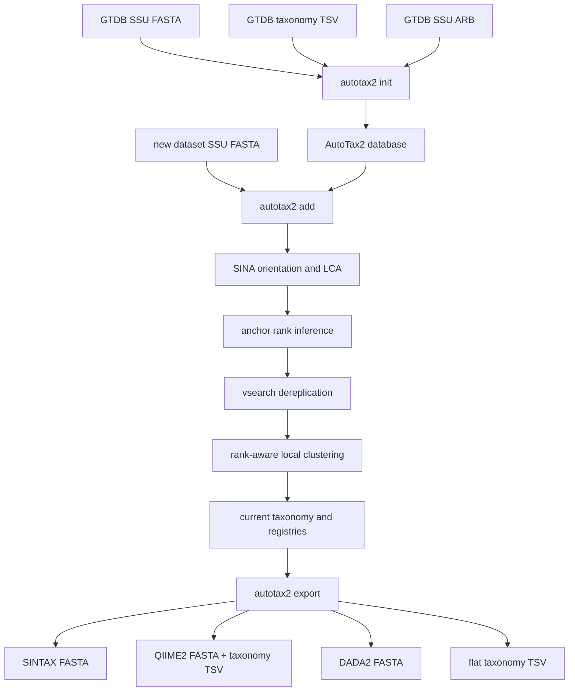
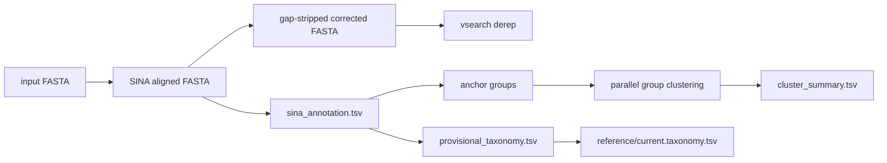

# AutoTax2

AutoTax2 builds a GTDB-anchored, incremental SSU/16S taxonomy reference. It
keeps the GTDB-derived backbone stable, then adds downstream SSU datasets by
orienting sequences with SINA, assigning a trusted GTDB anchor rank, clustering
novel sequence pools with vsearch, and exporting classifier-ready references.

The project is designed for reproducible reference construction: every database
has durable registries, versioned dataset outputs, placeholder counters,
cluster membership tables, and audit logs.

## Core Ideas

- GTDB-derived SSU taxonomy is the named backbone.
- SINA runs against a user-built `gtdb_ssu.arb` file to orient query sequences
  and emit alignment/LCA metadata.
- vsearch clusters only the novel lineage space below the trusted GTDB anchor
  rank.
- Placeholder names are global within each rank and carry the first source
  prefix, for example `s__midas_s000001`.
- Dataset FASTA inputs must already be extracted SSU/16S sequences. AutoTax2
  does not extract rRNA genes from genomes or contigs.
- Export files are reproducible build artifacts for SINTAX, QIIME2, DADA2, and
  plain taxonomy workflows.

## Workflow Map



## Installation

Install AutoTax2 from a checkout:

```bash
git clone https://github.com/ypchan/autotax2.git
cd autotax2
python -m venv .venv
source .venv/bin/activate
python -m pip install -U pip
python -m pip install -e ".[dev]"
```

Check the Python package:

```bash
autotax2 --help
pytest
ruff check autotax2 tests
```

## External Tools

AutoTax2 calls external executables. They must be visible on `PATH` unless you
store custom paths in the database configuration.

```bash
sina --version
vsearch --version
```

Recommended versions:

- SINA 1.7.2
- vsearch 2.30.6 Linux x86_64 or newer compatible vsearch 2.x

### SINA Command Role

AutoTax2 uses SINA for query orientation and GTDB anchor inference. The internal
command has this shape:

```bash
sina \
  -i new_dataset.fa \
  -o autotax2_db/versions/v001_source/01_sina/new.sina.aligned.fa \
  -r autotax2_db/reference/gtdb_ssu.arb \
  --threads 64 \
  --log-file autotax2_db/versions/v001_source/01_sina/sina.log
```

Expected SINA header fields include:

```text
[align_ident_slv=88.5] [align_quality_slv=90] [lca_tax_gtdb=d__Bacteria;p__...;] [turn=reversed and complemented]
```

SINA may emit names ending in `_slv` even when the reference is your
`gtdb_ssu.arb`; AutoTax2 treats those as reference metrics in that situation.
Normalized fields are also accepted:

```text
[align_ident_ref=88.5] [align_quality_ref=90] [lca_tax_ref=d__Bacteria;p__...;]
```

### vsearch Command Roles

AutoTax2 uses vsearch for dereplication and clustering.

Dereplication:

```bash
vsearch \
  --derep_fulllength new.sina.corrected.fa \
  --output new.derep.fa \
  --uc new.derep.uc \
  --sizeout \
  --threads 64
```

Rank clustering:

```bash
vsearch \
  --cluster_fast group_1.fa \
  --id 0.972 \
  --iddef 2 \
  --strand plus \
  --centroids species.centroids.fa \
  --uc species.uc \
  --threads 16
```

`--iddef 2` is the default identity definition and should remain fixed unless a
run explicitly documents a different scientific reason.

## Quick Start

### 1. Check Dependencies

```bash
autotax2 check --debug
```

Parameters:

| parameter | default | meaning |
|---|---:|---|
| `--sina-bin` | `sina` | SINA executable name or path. |
| `--vsearch-bin` | `vsearch` | vsearch executable name or path. |
| `--debug` | `False` | Print debug logs and include external command output in logs. |

### 2. Initialize a GTDB Backbone Database

```bash
autotax2 init \
  --ref-fa gtdb_ssu_tax.fa \
  --ref-tax gtdb_ssu.taxonomy.tsv \
  --ref-arb gtdb_ssu.arb \
  --db autotax2_db \
  --threads 64 \
  --debug
```

Parameters:

| parameter | required | meaning |
|---|---:|---|
| `--ref-fa` | yes | GTDB-derived SSU reference FASTA. Sequence IDs must match `seq_id` in the taxonomy TSV. |
| `--ref-tax` | yes | GTDB-derived taxonomy TSV with one row per reference sequence. |
| `--ref-arb` | yes | SINA-compatible ARB file built from the same GTDB SSU reference. |
| `--db` | yes | Output AutoTax2 database directory. |
| `--threads`, `-t` | no | CPU thread budget recorded in `config.yaml` and used by long-running commands. |
| `--force` | no | Delete and rebuild an existing non-empty database directory. Use carefully. |
| `--debug` | no | Enable debug logging for initialization. |

Required columns in `gtdb_ssu.taxonomy.tsv`:

```text
seq_id    domain    phylum    class    order    family    genus    species
```

Optional columns are preserved when present:

```text
evidence_level    source    length
```

Important outputs:

```text
autotax2_db/config.yaml
autotax2_db/reference/gtdb_ssu_tax.fa
autotax2_db/reference/gtdb_ssu.taxonomy.tsv
autotax2_db/reference/gtdb_ssu.arb
autotax2_db/reference/current.fa
autotax2_db/reference/current.taxonomy.tsv
autotax2_db/registry/sequence_registry.tsv
autotax2_db/registry/cluster_registry.tsv
autotax2_db/registry/placeholder_counter.tsv
autotax2_db/registry/source_registry.tsv
autotax2_db/clusters/<rank>.membership.tsv
autotax2_db/logs/init.log
```

### 3. Add a Dataset

```bash
autotax2 add \
  --db autotax2_db \
  --input MiDAS5.3.ssu.fa \
  --source midas \
  --prefix midas \
  --threads 64 \
  --group-jobs 4 \
  --mode incremental \
  --debug
```

Parameters:

| parameter | required | meaning |
|---|---:|---|
| `--db` | yes | Existing AutoTax2 database directory. |
| `--input` | yes | New dataset FASTA containing externally extracted SSU/16S sequences. |
| `--source` | yes | Human-readable source name, for example `midas`, `mfd`, or `hifimeta`. |
| `--prefix` | yes | Stable placeholder prefix for new lineages created first by this source. |
| `--threads`, `-t` | no | Total CPU thread budget for SINA, vsearch dereplication, and clustering. |
| `--group-jobs` | no | Number of independent anchor groups to cluster concurrently. Default is automatic from `--threads`. |
| `--mode` | no | `incremental` or `full`. Current default is `incremental`. |
| `--keep-temp` | no | Keep intermediate files. Useful for debugging SINA and vsearch behavior. |
| `--dry-run` | no | Validate paths and print external commands without running downstream table generation. |
| `--debug` | no | Enable detailed logs. |

Add workflow:



Important outputs for one dataset:

```text
autotax2_db/versions/v001_midas/01_sina/new.sina.aligned.fa
autotax2_db/versions/v001_midas/01_sina/new.sina.corrected.fa
autotax2_db/versions/v001_midas/sina_annotation.tsv
autotax2_db/versions/v001_midas/02_derep/new.derep.fa
autotax2_db/versions/v001_midas/02_derep/new.derep.uc
autotax2_db/versions/v001_midas/03_clusters/group_*.fa
autotax2_db/versions/v001_midas/03_clusters/group_*/*.uc
autotax2_db/versions/v001_midas/03_clusters/group_*.membership.tsv
autotax2_db/versions/v001_midas/cluster_summary.tsv
autotax2_db/versions/v001_midas/provisional_taxonomy.tsv
autotax2_db/logs/add_midas.log
```

## Anchor and Placeholder Logic

AutoTax2 picks the finest trusted anchor rank from SINA identity and GTDB LCA
taxonomy.

| rank | identity cutoff |
|---|---:|
| species | 97.2 |
| genus | 90.1 |
| family | 80.1 |
| order | 72.9 |
| class | 72.2 |
| phylum | 69.6 |

Example:

```text
SINA LCA: d__Bacteria;p__Pseudomonadota;c__Gammaproteobacteria;o__...;f__...
SINA identity: 85.0
trusted anchor: family
novel ranks: genus, species
```

Placeholder IDs are allocated globally by rank:

```text
s__midas_s000001
s__mfd_s000002
g__midas_g000001
g__hifimeta_g000002
```

The number is not reset for each source. Retired or deprecated IDs must never be
reused.

## Export References

```bash
autotax2 export \
  --db autotax2_db \
  --format all \
  --out export/
```

Parameters:

| parameter | required | meaning |
|---|---:|---|
| `--db` | yes | Existing AutoTax2 database directory. |
| `--format` | yes/no | One of `all`, `sintax`, `dada2`, `qiime2`, or `taxonomy`. Default is `all`. |
| `--out` | yes | Output file or directory. Use a directory for `all` and `qiime2`. |
| `--debug` | no | Enable export logs. |

Export outputs:

```text
export/autotax2.sintax.fa
export/autotax2.dada2.fa
export/autotax2.qiime2-seqs.fa
export/autotax2.qiime2-taxonomy.tsv
export/autotax2.taxonomy.tsv
```

## Rebuild

```bash
autotax2 rebuild \
  --db autotax2_db \
  --threads 64 \
  --debug
```

Parameters:

| parameter | required | meaning |
|---|---:|---|
| `--db` | yes | Existing AutoTax2 database directory. |
| `--threads`, `-t` | no | CPU threads for each vsearch rank-clustering step. |
| `--dry-run` | no | Print commands without running vsearch. |
| `--debug` | no | Enable debug logs. |

Rebuild is rank-sequential by design: species centroids feed genus clustering,
genus centroids feed family clustering, and so on. vsearch can still use many
threads within each rank.

## Summarize Source Overlap

```bash
autotax2 summarize \
  --db autotax2_db \
  --rank species \
  --out species.summary.tsv
```

Parameters:

| parameter | required | meaning |
|---|---:|---|
| `--db` | yes | Existing AutoTax2 database directory. |
| `--rank` | no | Rank to summarize: `species`, `genus`, `family`, `order`, `class`, or `phylum`. |
| `--out` | no | Optional TSV output path. |
| `--debug` | no | Enable debug logs. |

## Threading and Performance

`--threads` is the total thread budget that AutoTax2 passes to external tools.
SINA and dereplication usually run as one external process and receive the full
budget.

The expensive `add` step can contain many independent anchor groups. Those
groups are safe to cluster concurrently because each group is defined by its
trusted anchor context and writes separate FASTA, UC, centroid, membership, and
log files.

Recommended strategy:

```text
few huge anchor groups:
  use --group-jobs 1 or 2, keep more threads per vsearch process

many small or medium anchor groups:
  use automatic --group-jobs, or set 4 to 16 on large servers

multiple AutoTax2 runs on the same server:
  lower --threads or --group-jobs to avoid oversubscription
```

The safe parallel budget is:

```text
group_jobs <= threads
threads_per_group = max(1, floor(threads / group_jobs))
```

This keeps the total vsearch CPU request close to the user-provided thread
budget while avoiding idle cores when individual anchor groups are small.

## Database Layout

```text
autotax2_db/
  config.yaml
  reference/
    current.fa
    current.taxonomy.tsv
    gtdb_ssu_tax.fa
    gtdb_ssu.taxonomy.tsv
    gtdb_ssu.arb
  registry/
    sequence_registry.tsv
    cluster_registry.tsv
    placeholder_counter.tsv
    source_registry.tsv
  clusters/
    species.membership.tsv
    genus.membership.tsv
    ...
  versions/
    v001_midas/
      01_sina/
      02_derep/
      03_clusters/
      sina_annotation.tsv
      cluster_summary.tsv
      provisional_taxonomy.tsv
  logs/
  export/
```

## Development

```bash
python -m pip install -e ".[dev]"
pytest
ruff check autotax2 tests
```

When changing user-facing behavior, keep these in sync:

- CLI option definitions and help text
- README command examples
- tests for parsing, registries, and export format compatibility
- `AGENTS.md` project rules
