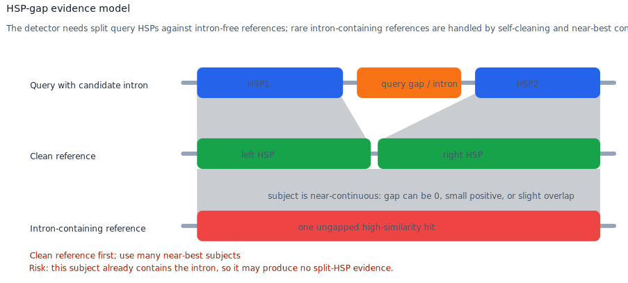
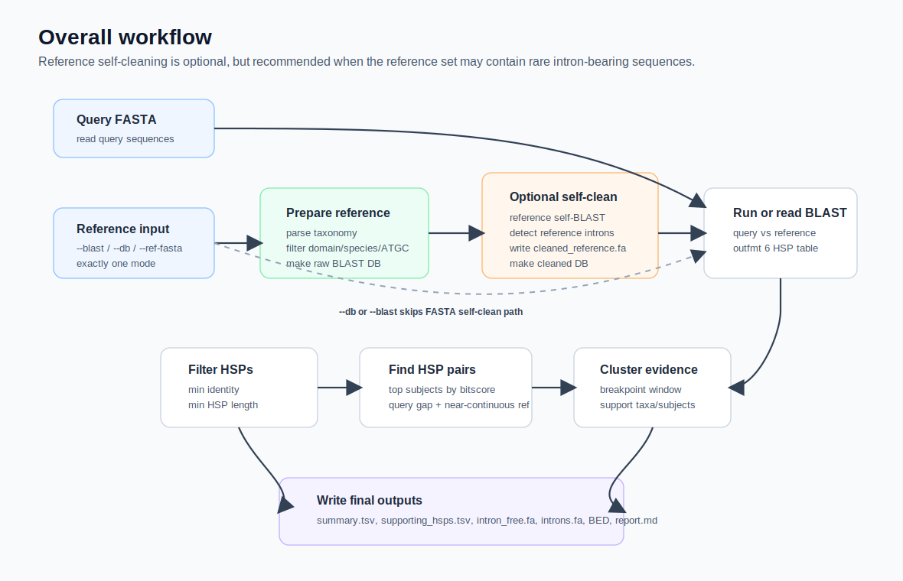
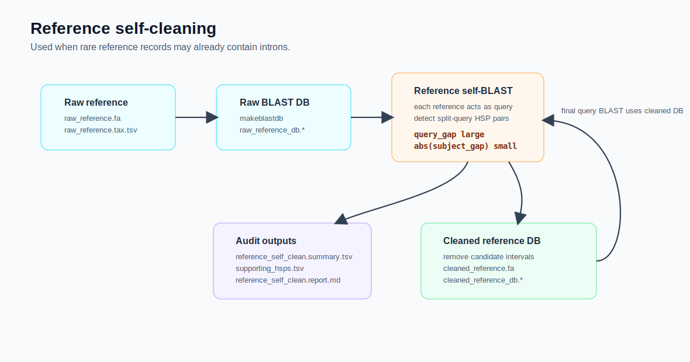
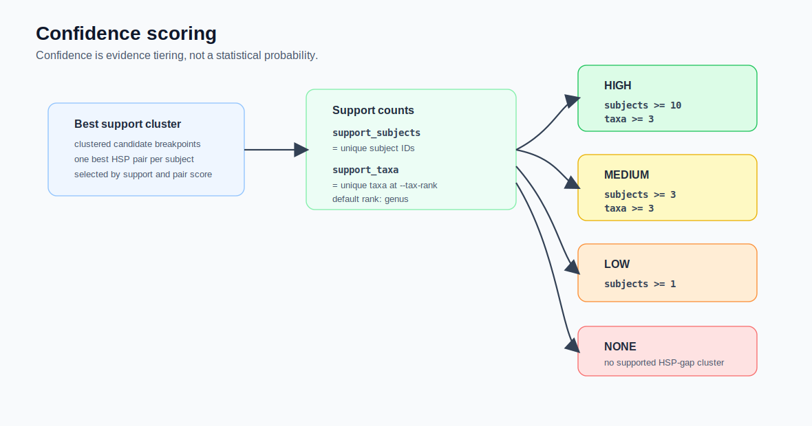

# Technical Documentation for `detect_intron_by_blastn.py`

This document describes the purpose, input modes, algorithm, formulas, parameters, outputs, interpretation rules, and recommended usage patterns for `scripts/detect_intron_by_blastn.py`.

The documentation is based on the current script implementation. It is written as a technical reference for users who need to understand exactly how candidate introns are detected from BLASTN HSP geometry.

## 1. Purpose

`detect_intron_by_blastn.py` detects candidate intron-containing 16S/SSU rRNA sequences from BLASTN high-scoring pair (HSP) patterns.

The script outputs:

- A per-query summary table with candidate intron coordinates, confidence labels, and support counts.
- A detailed table of supporting HSP pairs.
- An intron-free FASTA containing all input query sequences.
- A candidate intron FASTA containing only introns that pass the output confidence threshold.
- Intron and exon BED files for candidates that pass the output confidence threshold.
- A Markdown report summarizing the run.

The core idea is:

```text
If a query contains an insertion/intron and the reference subject does not,
BLASTN often produces two adjacent query HSPs separated by a large query gap.
The corresponding subject positions should be nearly continuous.
```



Important terminology:

- `query_gap` is the inferred candidate intron interval on the query.
- `subject_gap` is a continuity metric between the two subject-side HSPs.
- `subject_gap` does not mean the subject must contain a real gap. It can be `0`, a small positive gap, or a small negative value caused by slight HSP overlap.
- The script accepts a subject only when `abs(subject_gap) <= --max-ref-gap`.

The detector does not conclude that a query lacks an intron just because one reference aligns without a gap. A no-gap alignment against one subject is simply non-supporting evidence. A candidate intron requires one or more subjects showing the split-query, near-continuous-subject pattern.

## 2. Dependencies

Python package dependencies:

- `rich`
- `rich-argparse`

External tool dependencies:

- `blastn`, required when using `--db` or `--ref-fasta`.
- `makeblastdb`, required when using `--ref-fasta` and when `--clean-ref-introns` is enabled.

If the script fails with `ModuleNotFoundError: No module named 'rich_argparse'`, install the missing package in the runtime environment:

```bash
python -m pip install rich rich-argparse
```

## 3. Input Modes

Exactly one of `--blast`, `--db`, or `--ref-fasta` must be provided.

### 3.1 Existing BLAST Table: `--blast`

Use this mode when BLASTN has already been run externally.

The BLAST table must be tab-delimited BLAST outfmt 6 with at least these columns in this exact order:

```text
qseqid sseqid pident length qstart qend sstart send evalue bitscore
```

Example:

```bash
python scripts/detect_intron_by_blastn.py \
  --query query_16s.fa \
  --blast query_vs_ref.blastn.tsv \
  --taxonomy reference.tax.tsv \
  --outdir intron_detection
```

### 3.2 Existing BLAST Database: `--db`

Use this mode when a nucleotide BLAST database already exists. The script runs `blastn` internally and parses the generated BLAST table.

Example:

```bash
python scripts/detect_intron_by_blastn.py \
  --query query_16s.fa \
  --db ref_db_prefix \
  --taxonomy reference.tax.tsv \
  --outdir intron_detection \
  --threads 8
```

### 3.3 SILVA-Style Reference FASTA: `--ref-fasta`

Use this mode when starting from a SILVA-style FASTA or FASTA.gz file. The script preprocesses the reference, builds a BLAST database, and runs query-vs-reference BLASTN.

The reference FASTA header must contain taxonomy after the sequence ID:

```text
>AB000393.1.1510 Bacteria;Pseudomonadota;...;Vibrio;Vibrio halioticoli
```

In this mode the script:

1. Reads the reference FASTA.
2. Parses taxonomy from headers.
3. Filters references by domain, per-species cap, and ATGC-only sequence content.
4. Writes `raw_reference.fa` and `raw_reference.tax.tsv`.
5. Builds `raw_reference_db`.
6. Optionally self-cleans reference introns when `--clean-ref-introns` is enabled.
7. Runs BLASTN from query sequences against the selected reference DB.

Example:

```bash
python scripts/detect_intron_by_blastn.py \
  --query query_16s.fa \
  --ref-fasta SILVA_NR99.fa.gz \
  --outdir intron_detection \
  --ref-domains Archaea,Bacteria \
  --ref-per-species 5 \
  --threads 8
```

## 4. Overall Workflow



At a high level:

1. Read query sequences.
2. Prepare or read BLAST HSPs.
3. Filter HSPs by identity and HSP length.
4. Group HSPs by `query_id -> subject_id`.
5. Keep the top subject hits for each query by total bitscore.
6. Search each query-subject pair for intron-like HSP-pair geometry.
7. Cluster candidate breakpoints across subjects.
8. Choose the best support cluster.
9. Assign confidence from subject and taxonomic support.
10. Write summary, supporting evidence, FASTA, BED, and report outputs.

## 5. Core Algorithm: `hsp-gap-support`

The current script has one algorithm: `hsp-gap-support`.

### 5.1 HSP Coordinates

For each BLAST HSP:

```text
qlo = min(qstart, qend)
qhi = max(qstart, qend)
slo = min(sstart, send)
shi = max(sstart, send)
qdir = +1 if qend >= qstart else -1
sdir = +1 if send >= sstart else -1
orientation = qdir * sdir
```

The script uses normalized low/high coordinates for interval calculations, while preserving orientation to compute subject continuity correctly.

### 5.2 HSP Prefiltering

Each HSP is discarded if:

```text
pident < --min-pident
length < --min-hsp-len
```

Remaining HSPs are grouped by query and subject:

```text
query_id -> subject_id -> list[HSP]
```

### 5.3 Top Subject Selection

For each query, subjects are ranked by total HSP bitscore:

```text
subject_score(subject) = sum(bitscore of all retained HSPs for this subject)
```

Only the top `--top-subjects` subjects are analyzed. This keeps the computation bounded and reduces noise, while still allowing near-best references to contribute evidence.

### 5.4 Candidate HSP-Pair Geometry

For each query-subject pair, the script tries every pair of HSPs. The two HSPs are ordered by query coordinates:

```text
left, right = HSPs ordered by (qlo, qhi)
```

The query-side gap is:

```text
query_gap = right.qlo - left.qhi - 1
```

The inferred query-relative intron coordinates are:

```text
intron_start = left.qhi + 1
intron_end   = right.qlo - 1
intron_len   = intron_end - intron_start + 1
```

For a candidate pair to be accepted:

```text
--min-intron-len <= query_gap <= --max-intron-len
--min-intron-len <= intron_len <= --max-intron-len
```

The implementation also checks query HSP overlap before the positive-gap test:

```text
if query_gap < 0 and abs(query_gap) > --max-query-overlap:
    reject
```

However, the later `query_gap >= --min-intron-len` condition means accepted candidates must still form a positive query gap at least as long as `--min-intron-len`. In practice, `--max-query-overlap` is a defensive guard for abnormal HSP pairs, not a way to accept overlapping candidate introns.

### 5.5 Subject Continuity Formula

The subject side must be nearly continuous in the same query order.

For same-orientation HSPs:

```text
subject_gap = right.slo - left.shi - 1
```

For opposite-orientation HSPs:

```text
subject_gap = left.slo - right.shi - 1
```

A pair is accepted only if:

```text
abs(subject_gap) <= --max-ref-gap
```

Interpretation:

- `subject_gap = 0`: subject HSPs are exactly adjacent.
- `subject_gap > 0`: subject has a small interval between the two HSPs.
- `subject_gap < 0`: subject HSPs slightly overlap.
- Large absolute values are rejected because the subject is no longer near-continuous.

### 5.6 Pair Score

Each accepted HSP pair receives:

```text
pair_score = hsp1.bitscore + hsp2.bitscore - 2 * abs(subject_gap)
```

This favors strong two-sided alignments and penalizes imperfect subject continuity.

For each subject, only the accepted HSP pair with the highest `pair_score` is retained.

### 5.7 Intron-Containing Reference Alignments

An intron-containing reference can align differently from an intron-free reference.

Against an intron-free subject:

```text
query:   exon-left  [candidate intron]  exon-right
subject: exon-left  [near-continuous]   exon-right
```

This creates the key evidence pattern:

```text
large query_gap + near-continuous subject
```

Against a subject that already contains an intron at the same or nearby position:

```text
query:   exon-left  [intron]  exon-right
subject: exon-left  [intron]  exon-right
```

BLASTN may produce one long ungapped HSP, or HSPs that do not show a query-only insertion. The script does not treat this as evidence against an intron. It simply means that subject provides no split-HSP support.

This distinction matters when the reference database contains rare intron-bearing records. If the query is most similar to one of those records, the best hit may be uninformative. The script therefore uses many top subjects and can optionally self-clean the reference.

### 5.8 Reference Self-Cleaning



When `--clean-ref-introns` is enabled in `--ref-fasta` mode, each reference sequence is temporarily treated as a query against the reference DB. If a reference sequence shows:

```text
large query_gap + near-continuous subject
```

relative to many other references, it is classified as a candidate intron-bearing reference record. If its confidence reaches `--ref-clean-min-confidence`, the candidate intron interval is removed before the final query BLASTN run.

This works best when intron-bearing references are rare. If fewer than about 1% of references contain introns, the majority intron-free references provide a strong near-continuous baseline during self-BLAST.

### 5.9 Breakpoint Clustering

Each retained subject contributes at most one support pair. The script clusters all support pairs for a query by similar query-relative intron coordinates.

A pair joins an existing cluster when:

```text
abs(pair.intron_start - median(cluster.intron_start)) <= --breakpoint-window
and
abs(pair.intron_end - median(cluster.intron_end)) <= --breakpoint-window
```

Otherwise a new cluster is created.

The best cluster is chosen by sorting clusters in descending order by:

```text
(
  number_of_pairs,
  number_of_non_NA_taxa_at_selected_rank,
  sum(pair_score)
)
```

### 5.10 Final Coordinates

The final query-relative intron coordinates are the medians of the best cluster:

```text
final_intron_start = round(median(cluster.intron_start))
final_intron_end   = round(median(cluster.intron_end))
final_intron_len   = final_intron_end - final_intron_start + 1
```

Coordinate conventions:

- `intron_start` and `intron_end` are query-relative, 1-based, closed-interval coordinates.
- `exon1 = 1-(intron_start - 1)`.
- `exon2 = (intron_end + 1)-query_len`.
- BED start is `intron_start - 1`.
- BED end is `intron_end`, following the standard 0-based half-open BED convention.

## 6. Confidence Model



The `confidence` value is not a statistical probability. It is an evidence tier based on how many independent subjects and taxonomic groups support the same candidate breakpoint cluster.

For the best support cluster:

```text
support_subjects = count_unique(subject_id)
support_taxa     = count_unique(taxon_at_--tax-rank where taxon != "NA")
```

The default taxonomic rank is `genus`, so the default support field is:

```text
support_taxa_at_genus
```

Default thresholds:

| Confidence | Classification | Default rule |
| --- | --- | --- |
| `HIGH` | `HIGH_CONFIDENCE_16S_INTRON` | `support_subjects >= 10` and `support_taxa >= 3` |
| `MEDIUM` | `MEDIUM_CONFIDENCE_16S_INTRON` | `support_subjects >= 3` and `support_taxa >= 3` |
| `LOW` | `LOW_CONFIDENCE_16S_INTRON` | `support_subjects >= 1` |
| `NONE` | `NO_INTRON_SIGNAL` | no supported HSP-gap cluster |

The HSP filters and geometry filters happen before confidence assignment. Parameters such as `--min-pident`, `--min-hsp-len`, `--max-ref-gap`, and `--breakpoint-window` shape which evidence reaches the confidence model, but the final confidence label is based on subject and taxonomic support counts.

## 7. Complete Parameter Reference

### 7.1 Required Inputs

| Parameter | Default | Applies to | Explanation |
| --- | --- | --- | --- |
| `--query PATH` | none | all modes | Query 16S/SSU FASTA or FASTA.gz. The sequence ID is the first whitespace-delimited token after `>`. |
| `--blast PATH` | not used | `--blast` mode | Existing BLASTN outfmt 6 table. Use this when BLAST has already been run. Mutually exclusive with `--db` and `--ref-fasta`. |
| `--db PATH` | not used | `--db` mode | Existing BLAST nucleotide database prefix. The script runs query BLASTN against this DB. Mutually exclusive with `--blast` and `--ref-fasta`. |
| `--ref-fasta PATH` | not used | `--ref-fasta` mode | SILVA-style reference FASTA or FASTA.gz with taxonomy in headers. The script preprocesses it, builds a BLAST DB, and optionally self-cleans reference introns. |
| `--outdir PATH` | none | all modes | Output directory. The script creates `reference/`, `blast/`, and `results/` subdirectories as needed. |

### 7.2 Algorithm Selection

| Parameter | Default | Allowed values | Explanation |
| --- | --- | --- | --- |
| `--algorithm` | `hsp-gap-support` | `hsp-gap-support` | Current detection algorithm. It detects split-query HSPs with near-continuous subject coordinates. |

### 7.3 Reference Preprocessing and BLAST HSP Filtering

| Parameter | Default | Applies to | Explanation |
| --- | --- | --- | --- |
| `--ref-domains` | `Archaea,Bacteria` | `--ref-fasta` | Comma-separated list of allowed first taxonomy fields. Reference records outside these domains are skipped. |
| `--ref-per-species` | `5` | `--ref-fasta` | Maximum number of reference records retained per species-level taxonomy string. Use `0` to disable this cap. This reduces over-representation by heavily sampled species. |
| `--clean-ref-introns` | off | `--ref-fasta` | Runs reference self-BLAST, detects candidate introns in reference records, removes passing candidates, and builds a cleaned reference DB for query BLAST. Recommended when rare intron-containing references may exist. |
| `--ref-clean-min-confidence` | `LOW` | `--clean-ref-introns` | Minimum confidence required to remove a candidate intron from a reference record during self-cleaning. Use `MEDIUM` or `HIGH` if you want more conservative reference modification. |
| `--ref-self-blast-max-target-seqs` | `100` | `--clean-ref-introns` | Value passed as BLASTN `-max_target_seqs` during reference self-BLAST. Increase this when the reference is large or when rare intron-bearing references need more comparison subjects. |
| `--ref-self-blast-max-hsps` | `20` | `--clean-ref-introns` and query BLAST helper | Value passed as BLASTN `-max_hsps` during reference self-BLAST. Higher values allow more local HSPs per subject. |
| `--min-pident` | `75.0` | all modes | Minimum BLAST HSP percent identity. HSPs below this value are ignored before any intron geometry is evaluated. |
| `--min-hsp-len` | `100` | all modes | Minimum HSP length in bp. Short HSPs are ignored because they can create unstable gap geometry. |
| `--top-subjects` | `100` | all modes | Number of top subjects retained per query after ranking by total HSP bitscore. Increase this to reduce false negatives when the best subject may itself contain an intron. |
| `--makeblastdb-bin` | `makeblastdb` | `--ref-fasta` and `--clean-ref-introns` | Executable name or path for `makeblastdb`. Use this when BLAST+ is installed under a nonstandard path. |
| `--blastn-bin` | `blastn` | `--db`, `--ref-fasta`, self-clean | Executable name or path for `blastn`. Use this when BLAST+ is installed under a nonstandard path. |
| `--blast-max-target-seqs` | `100` | query BLAST | Value passed as BLASTN `-max_target_seqs` for query-vs-reference BLAST. Increase this when the reference may contain rare intron-bearing nearest neighbors and you want more near-best subjects. |
| `--blast-max-hsps` | `20` | query BLAST | Value passed as BLASTN `-max_hsps` for query-vs-reference BLAST. Higher values allow more local HSPs per subject. |
| `--blast-task` | `blastn` | internal BLAST calls | BLASTN task. Allowed values are `blastn`, `megablast`, `dc-megablast`, and `blastn-short`. `blastn` is the general default. |
| `--blast-evalue` | `1e-20` | internal BLAST calls | E-value threshold passed to BLASTN. If supplied as an empty/false value in the runtime environment, the script does not add `-evalue`. |

### 7.4 Candidate Intron Geometry

| Parameter | Default | Formula role | Explanation |
| --- | --- | --- | --- |
| `--min-intron-len` | `25` | lower bound for `query_gap` and `intron_len` | Minimum query insertion size accepted as a candidate intron. This is the real lower bound for accepted query gaps. |
| `--max-intron-len` | `2000` | upper bound for `query_gap` and `intron_len` | Maximum query insertion size accepted as a candidate intron. Increase only if very long introns are expected. |
| `--max-ref-gap` | `30` | `abs(subject_gap) <= value` | Maximum allowed absolute subject gap or overlap. Lower values require tighter reference continuity. Positive, zero, and negative subject gaps are allowed if the absolute value is small enough. |
| `--max-query-overlap` | `20` | defensive overlap guard | Maximum allowed query HSP overlap before the positive-gap filter. Because accepted pairs must still satisfy `query_gap >= --min-intron-len`, this mostly protects against abnormal overlapping HSP pairs. |
| `--breakpoint-window` | `30` | cluster membership window | Maximum allowed deviation from an existing cluster median for both `intron_start` and `intron_end`. Larger values merge more variable breakpoints; smaller values split nearby calls. |

### 7.5 Taxonomic Support

| Parameter | Default | Allowed values | Explanation |
| --- | --- | --- | --- |
| `--taxonomy PATH` | none | TSV file | Optional subject taxonomy table with two columns: `subject_id<TAB>taxonomy`. In `--ref-fasta` mode this is generated automatically. Without taxonomy, `support_taxa` is reduced and MEDIUM/HIGH confidence is harder to reach. |
| `--tax-rank` | `genus` | `domain`, `phylum`, `class`, `order`, `family`, `genus`, `species` | Taxonomic rank used for `support_taxa`. The default `genus` requires evidence across multiple genera instead of repeated near-identical records from one genus. |

### 7.6 Confidence Thresholds and Output Filtering

| Parameter | Default | Explanation |
| --- | --- | --- |
| `--min-support-subjects` | `1` | Minimum unique supporting subjects needed for `LOW`. |
| `--medium-support-subjects` | `3` | Minimum unique supporting subjects needed for `MEDIUM`. |
| `--medium-support-taxa` | `3` | Minimum unique taxa at `--tax-rank` needed for `MEDIUM`. With defaults, this means at least 3 genera. |
| `--high-support-subjects` | `10` | Minimum unique supporting subjects needed for `HIGH`. |
| `--high-support-taxa` | `3` | Minimum unique taxa at `--tax-rank` needed for `HIGH`. With defaults, this means at least 3 genera. |
| `--min-output-confidence` | `LOW` | Minimum confidence required for a candidate to be removed in `intron_free` FASTA and written to intron FASTA/BED. The `intron_free` FASTA still contains all query sequences; candidates below this threshold remain unchanged. |
| `--gzip-fasta-output` | off | Writes `*.intron_free.fa.gz` and `*.introns.fa.gz` instead of uncompressed FASTA. BED, TSV, and report files remain uncompressed. |

### 7.7 Runtime and Logging

| Parameter | Default | Explanation |
| --- | --- | --- |
| `--threads` | `4` | Number of Python worker threads. Internal BLASTN calls also receive this value as `-num_threads`. |
| `--verbose` | off | Enables debug-level logging. Useful for troubleshooting parameter choices or unexpected filtering. |

## 8. Output Directory Structure

Assume:

```text
--outdir intron_detection
--query sample.fa
```

The output layout is:

```text
intron_detection/
  reference/
    raw_reference.fa
    raw_reference.tax.tsv
    raw_reference_db.*
    reference_self.blastn.tsv
    reference_self_clean.summary.tsv
    reference_self_clean.supporting_hsps.tsv
    reference_self_clean.report.md
    cleaned_reference.fa
    cleaned_reference.tax.tsv
    cleaned_reference_db.*
  blast/
    sample.vs_reference.blastn.tsv
  results/
    sample.summary.tsv
    sample.supporting_hsps.tsv
    sample.intron_free.fa
    sample.introns.fa
    sample.exons.bed
    sample.introns.bed
    sample.report.md
```

Mode-specific notes:

- `--blast` mode does not create reference preprocessing files or query BLAST intermediates.
- `--db` mode creates the query BLAST table under `blast/`.
- `--ref-fasta` mode creates raw reference FASTA, taxonomy, and BLAST DB files.
- `--clean-ref-introns` additionally creates reference self-clean files and a cleaned reference DB.
- `--gzip-fasta-output` changes `sample.intron_free.fa` and `sample.introns.fa` to `.fa.gz`.

## 9. Output File Semantics

### 9.1 `*.summary.tsv`

One row per query.

| Field | Meaning |
| --- | --- |
| `query_id` | Query FASTA ID. |
| `query_len` | Query sequence length. |
| `classification` | Classification label, such as `HIGH_CONFIDENCE_16S_INTRON` or `NO_INTRON_SIGNAL`. |
| `confidence` | `HIGH`, `MEDIUM`, `LOW`, or `NONE`. |
| `intron_start` | Query-relative 1-based candidate intron start. Empty if no supported signal. |
| `intron_end` | Query-relative 1-based candidate intron end. Empty if no supported signal. |
| `intron_len` | Candidate intron length. |
| `exon1` | Query-relative 1-based closed interval for exon 1. |
| `exon2` | Query-relative 1-based closed interval for exon 2. |
| `intron_free_len` | Length of `exon1 + exon2`. |
| `support_subjects` | Number of unique supporting subjects in the best cluster. |
| `support_taxa_at_<rank>` | Number of unique taxa at the selected `--tax-rank`; default field is `support_taxa_at_genus`. |
| `support_species` | Unique species-level taxa in the best cluster. |
| `support_genera` | Unique genus-level taxa in the best cluster. |
| `median_subject_gap` | Median subject gap in the best cluster. Values near 0 indicate strong subject continuity. |
| `median_pident` | Median average percent identity across the paired HSPs. |
| `mean_bitscore` | Mean paired-HSP bitscore sum in the best cluster. |
| `best_subject` | Subject with the highest `pair_score` in the best cluster. |
| `best_subject_taxonomy` | Taxonomy of `best_subject`. |
| `reasons` | Pipe-delimited reasons and algorithm metadata. |

### 9.2 `*.supporting_hsps.tsv`

One row per supporting subject pair in the best cluster.

| Field | Meaning |
| --- | --- |
| `query_id` | Query ID. |
| `subject_id` | Subject supporting the candidate intron. |
| `taxonomy` | Subject taxonomy string. |
| `taxon_at_rank` | Taxon extracted at `--tax-rank`. |
| `intron_start`, `intron_end`, `intron_len` | Query-relative intron coordinates inferred from this subject pair. |
| `query_gap` | Gap between the two HSPs on the query. |
| `subject_gap` | Gap or overlap between the two HSPs on the subject. Near 0 is best. |
| `hsp1_q`, `hsp2_q` | Query-side HSP intervals. |
| `hsp1_s`, `hsp2_s` | Subject-side HSP intervals, shown low-to-high. |
| `hsp1_pident`, `hsp2_pident` | Percent identity of each HSP. |
| `hsp1_len`, `hsp2_len` | Length of each HSP. |
| `bitscore_sum` | `hsp1.bitscore + hsp2.bitscore`. |
| `pair_score` | Pair score after subject-gap penalty. |

### 9.3 `*.intron_free.fa` or `*.intron_free.fa.gz`

This FASTA contains all query sequences, not only intron-positive sequences.

Rules:

- Output order follows the input FASTA order.
- If a candidate reaches `--min-output-confidence`, the intron interval is removed and the output sequence is `exon1 + exon2`.
- If no intron is detected, the original sequence is written unchanged.
- If a candidate exists but is below `--min-output-confidence`, the original sequence is written unchanged.

Example headers:

```text
>{query_id}|intron_free|intron={start}-{end}|confidence={confidence}|action=removed
>{query_id}|intron_free|intron={start}-{end}|confidence={confidence}|action=unchanged_below_min_output_confidence
>{query_id}|intron_free|intron=none|confidence=NONE|action=unchanged
```

### 9.4 `*.introns.fa` or `*.introns.fa.gz`

This FASTA contains only candidate intron sequences that reach `--min-output-confidence`.

Header format:

```text
>{query_id}|intron|{start}-{end}|len={len}|confidence={confidence}
```

### 9.5 BED Outputs

`*.introns.bed` records candidate intron intervals:

```text
query_id  intron_start-1  intron_end  name  .  +
```

`*.exons.bed` records exon 1 and exon 2 intervals for candidates that pass `--min-output-confidence`.

BED coordinates use 0-based half-open intervals:

```text
bed_start = intron_start - 1
bed_end   = intron_end
```

### 9.6 `*.report.md`

The Markdown report includes:

- Input files.
- Algorithm name.
- Key parameter values.
- Counts by confidence.
- Counts by classification.
- Candidate intron length summary.
- Top candidates.

## 10. Recommended Usage

### 10.1 Standard Screening

Use this when the reference is expected to be mostly intron-free:

```bash
python scripts/detect_intron_by_blastn.py \
  --query query_16s.fa \
  --ref-fasta SILVA_NR99.fa.gz \
  --outdir intron_detection \
  --threads 8
```

### 10.2 Reference May Contain Rare Intron-Bearing Records

If intron-bearing references are expected to be rare, for example below 1%, use reference self-cleaning and retain more near-best subjects:

```bash
python scripts/detect_intron_by_blastn.py \
  --query query_16s.fa \
  --ref-fasta SILVA_NR99.fa.gz \
  --outdir intron_detection_clean_ref \
  --clean-ref-introns \
  --ref-clean-min-confidence LOW \
  --ref-self-blast-max-target-seqs 300 \
  --blast-max-target-seqs 300 \
  --top-subjects 300 \
  --gzip-fasta-output \
  --threads 8
```

If reference self-cleaning seems too aggressive, first use:

```bash
--ref-clean-min-confidence MEDIUM
```

Then inspect:

```text
reference/reference_self_clean.report.md
reference/reference_self_clean.supporting_hsps.tsv
```

### 10.3 Conservative Geometry

Use this when false positives are more costly than false negatives:

```bash
--min-pident 85 \
--min-hsp-len 150 \
--max-ref-gap 10 \
--medium-support-subjects 5 \
--medium-support-taxa 3
```

Effect:

- Requires higher-quality HSPs.
- Requires tighter subject continuity.
- Requires more independent subject support for `MEDIUM`.

### 10.4 Sensitive Exploration

Use this when references are distant or sequence divergence is high:

```bash
--min-pident 70 \
--min-hsp-len 80 \
--max-ref-gap 50 \
--breakpoint-window 50
```

This may increase false positives. Review `*.supporting_hsps.tsv` carefully.

## 11. Review Checklist

Prioritize HIGH and MEDIUM candidates, then check:

1. Is `support_subjects` large enough?
2. Is `support_taxa_at_genus` or the selected `support_taxa_at_<rank>` spread across independent taxa?
3. Is `median_subject_gap` close to 0?
4. Is `median_pident` high enough for the dataset?
5. Do supporting subjects agree on `intron_start` and `intron_end`?
6. Does `best_subject_taxonomy` make biological sense for the query?
7. Is support dominated by one genus, one species, or nearly duplicate records?
8. Is the candidate length close to `--min-intron-len` or `--max-intron-len`?
9. Could the query be chimeric, low quality, truncated, or not a complete SSU/16S sequence?

## 12. Known Limitations

- The script does not extract rRNA genes. Input query sequences must already be externally extracted SSU/16S sequences.
- The script does not evaluate secondary structure or splice motifs.
- The final intron coordinates are query-relative median coordinates from the best support cluster.
- The final coordinates are not reference-relative coordinates.
- Intron-containing references can produce ungapped alignments and therefore non-supporting evidence; use `--clean-ref-introns` and larger `--top-subjects` values when this is expected.
- Missing taxonomy reduces `support_taxa` and makes MEDIUM/HIGH confidence harder to reach.
- In `--ref-fasta` mode, reference sequences containing non-ATGC bases are skipped.
- `--clean-ref-introns` modifies reference sequences for downstream query BLAST. Keep raw reference outputs for auditability.
